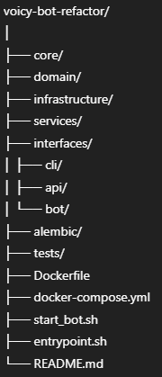

# Voicy — Тестовое задание

## Описание

Многоуровневый Python-проект на основе чистой архитектуры (SOLID, DI, сервисы, UnitOfWork), Docker и PostgreSQL. 
Включает три интерфейса: CLI, REST API (FastAPI), Telegram-бот (aiogram 3). 
Бизнес-логика отделена от транспорта и покрыта тестами.

---

## Быстрый старт (Docker Compose)

1. Клонируйте репозиторий:
    ```bash
    git clone https://github.com/yourusername/voicy-bot-refactor.git
    cd voicy-bot-refactor
    ```

2. Создайте `.env` с вашим Telegram Bot Token:
    ```env
    TG_BOT_TOKEN=ваш_токен
    ```

3. Запустите все сервисы:
    ```bash
    docker compose up --build
    ```

4. Swagger-документация будет доступна по адресу: [http://localhost:8000/docs](http://localhost:8000/docs)

5. Проверьте Telegram-бота: найдите по username, отправьте /start и /top

---

## Архитектура

- **core, domain, infrastructure, services** — слои бизнес-логики и работы с БД
- **interfaces/cli/** — CLI-интерфейс (Typer)
- **interfaces/api/** — FastAPI-интерфейс (Swagger)
- **interfaces/bot/** — aiogram 3, Telegram-бот
- **alembic/** — миграции базы данных
- **tests/** — unit/e2e тесты сервисного слоя

---

## Команды для разработки

- Запуск тестов:
    ```bash
    docker compose run --rm backend pytest
    ```
- CLI-команды:
    ```bash
    docker compose exec backend python interfaces/cli/main.py list-users
    docker compose exec backend python interfaces/cli/main.py register testuser
    ```
- Фоновая задача (по желанию):
    ```bash
    # Опишите запуск задачи через apscheduler, если реализовано
    ```

---

## Структура


---

## Эндпоинты FastAPI

- **POST /register** — регистрация пользователя
- **GET /top** — топ пользователей

---

## Проверка Telegram-бота

- `/start` — регистрация
- `/top` — список лучших пользователей

---

## SOLID и тесты

- Вся логика — через сервисы и репозитории (без обращения к БД из transport/handlers)
- Покрытие тестами бизнес-логики через pytest

---